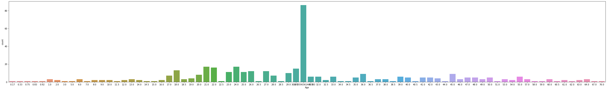
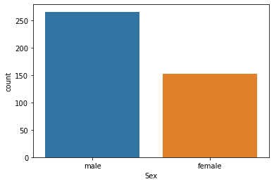
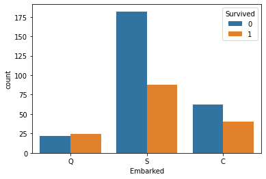
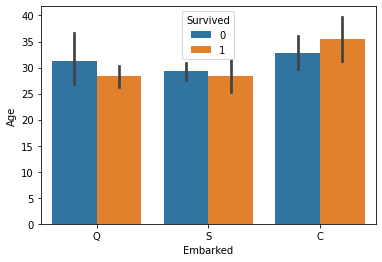
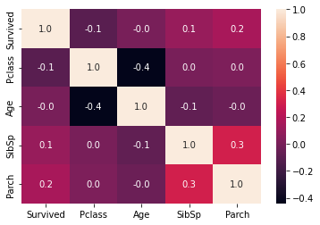

# Explorative Data Analysis on Titanic Dataset

This project was completed during an internship at **Aqmenz Automation Pvt Ltd** under the guidance of **Dr. Janhavi V** as part of academic curriculum at **VidyaVardhaka College of Engineering, Mysuru**.

## 📘 Overview

The goal of this project is to apply **Explorative Data Analysis (EDA)** on the Titanic dataset using Python and Jupyter Notebook. We extract meaningful insights through data visualization and statistical analysis.

## 🏢 About the Organization

**Aqmenz Automation Pvt Ltd** specializes in:
- Mechanical Design & Industrial Automation
- Product Design
- Python, Deep Learning, Embedded Systems

## 📂 Dataset

The dataset used is the Titanic passenger data from Kaggle, which includes details like:
- Passenger Age
- Gender
- Ticket Class
- Embarkment Port
- Survival Status

## 🧑‍💻 Tools and Libraries Used

- **Jupyter Notebook**
- **Pandas** – Data manipulation
- **NumPy** – Numerical operations
- **Matplotlib & Seaborn** – Data visualization

## 🔍 Steps in EDA

1. **Data Cleaning**
2. **Basic Statistics and Info**
3. **Univariate Analysis**
   - Age Distribution
   - Gender Count
   - Passenger Class
4. **Bivariate & Multivariate Analysis**
   - Survival vs Gender/Class/Age
   - Embarkment vs Survival
   - Class vs Age vs Survival

## 📊 Visualizations

Here are some of the charts generated during EDA:

| Description | Chart |
|------------|-------|
| Age Distribution |  |
| Gender Distribution |  |
| Class vs Survival |  |
| Embarkment vs Survival |  |
| Heatmap |  |

> 📁 _All charts are available in the `Charts/` folder._

## 🎓 Skills & Knowledge Gained

- Applied Python libraries to real-world data
- Learned to synthesize insights through visual tools
- Improved model understanding and data storytelling

## ✅ Conclusion

This project helped build strong foundations in:
- Time management
- Hands-on experience with data tools
- Real-world understanding of data pipelines and EDA

---